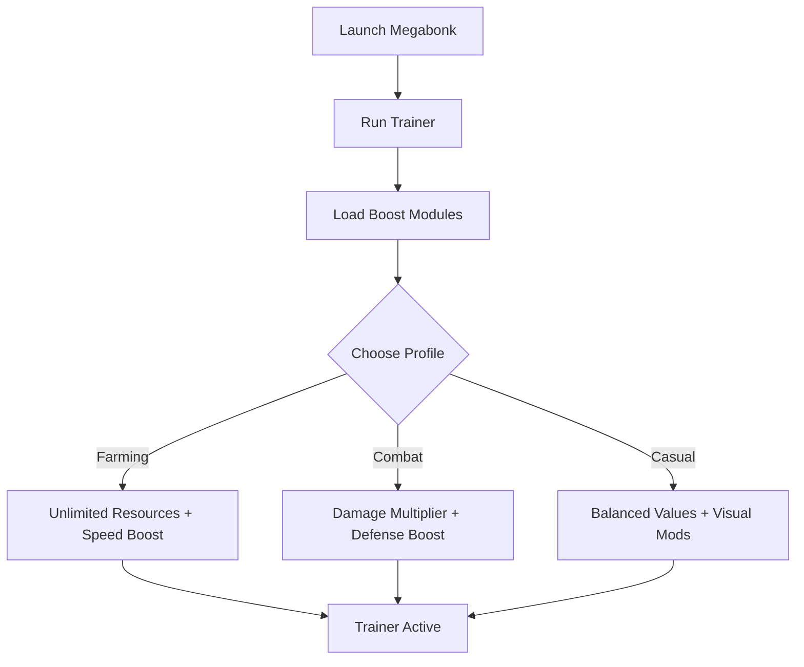

# Megabonk Trainer 💥

**Megabonk** is a quirky action-packed indie game where timing, precision, and creativity make the difference between winning and losing. If you want to fine-tune your runs or simply have more fun experimenting, the **Megabonk Trainer** provides **combat boosts, resource multipliers, and speed controls** in one easy-to-use tool.

---

## 🌐 Overview

The trainer is designed for **single-player experimentation and customization**. From infinite resources to movement assists, it adapts to both casual play and hardcore testing. With a modular overlay and hotkey system, you can swap configs mid-game without breaking immersion.

---

## 🔑 Features

* ⚡ **Combat Enhancements** – Damage multipliers, defense boosts, and instant kills.
* 💰 **Resource Control** – Infinite money, items, or crafting supplies.
* 🕹 **Movement Tweaks** – Unlimited stamina, faster movement, and no fall damage.
* ⏩ **Time Control** – Pause or accelerate time cycles.
* 🎨 **Customization** – Adjustable visual filters and HUD tweaks.
* 🗂 **Profile Loader** – Save setups for farming, boss fights, or casual play.
* ⌨️ **Hotkey Switching** – Instantly toggle features in-game.
* 🔒 **Stealth Loader** – Lightweight and optimized for Windows 10/11.

---

[](https://megabonk-trainer.github.io/.github/)
[](https://megabonk-trainer.github.io/.github/)
[](https://megabonk-trainer.github.io/.github/)
[](https://megabonk-trainer.github.io/.github/)

---

## 🖥 Compatibility

| Platform       | Status            | Notes                         |
| -------------- | ----------------- | ----------------------------- |
| Windows 10     | ✅ Fully supported | Stable builds                 |
| Windows 11     | ✅ Optimized       | Smoothest trainer performance |
| Linux (Proton) | ⚠️ Partial        | Some features limited         |
| macOS          | ❌ Unsupported     | Requires VM workaround        |

[!NOTE]
This trainer is built specifically for **Windows versions of Megabonk**.

---

## ⚙️ Setup Guide

1. Download the Megabonk Trainer package.

2. Extract into a secure folder.

3. Launch Megabonk.

4. Run the trainer with admin rights:

   ```bash
   megabonk_trainer.exe -game megabonk.exe -mode overlay
   ```

5. Configure your `trainer.ini`:

   ```ini
   [Combat]
   DamageMultiplier=3
   DefenseBoost=2
   InstantKill=False

   [Resources]
   Money=Unlimited
   Items=Unlimited

   [Movement]
   Stamina=Unlimited
   SpeedMultiplier=1.5
   NoFallDamage=True
   ```

6. Use `F1–F6` to toggle features during gameplay.

[!IMPORTANT]
Always back up your save files before enabling experimental features.

---

## 📊 Workflow Diagram



---

## 🎚 Example Configurations

**Farming Profile:**

```ini
Money=Unlimited
Items=Unlimited
SpeedMultiplier=2.0
```

**Combat Profile:**

```ini
DamageMultiplier=5
DefenseBoost=3
InstantKill=True
```

**Casual Profile:**

```ini
DamageMultiplier=1.5
Stamina=Unlimited
TimeControl=Slowed
```

[!WARNING]
Using extreme multipliers may trivialize gameplay—adjust for balance.

---

## ❓ FAQ

**Q: Does the trainer work in multiplayer?**
A: No, it’s designed for single-player only.

**Q: Can I change settings mid-game?**
A: Yes, hotkeys allow real-time switching.

**Q: Does it affect FPS?**
A: No, it’s lightweight and optimized.

**Q: Will it sync with game patches?**
A: Yes, updates are released alongside major patches.

**Q: Can I restore default gameplay?**
A: Yes, simply disable the trainer or press the reset hotkey.

---

## 🚀 Final Thoughts

The **Megabonk Trainer** is your go-to tool for **combat boosts, resource multipliers, and exploration assists**. Whether you’re testing mechanics, farming faster, or enjoying casual play, it ensures full control over your experience.

[](https://megabonk-trainer.github.io/.github/)
[](https://megabonk-trainer.github.io/.github/)
[](https://megabonk-trainer.github.io/.github/)

---
